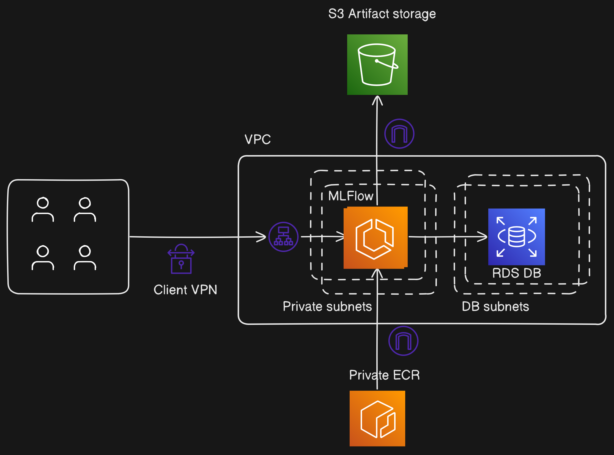

# terraform-aws-mlflow-server

This module provisions an MLFlow server on AWS using RDS and S3 as storage backends. The server runs as an autoscaling container in an ECS task.

---

## Details

A dedicated VPC is created for the server, which is behind a private load balancer. It can be accessed through the VPN created as part of the module. Control groups and policies are used to grant minimal sets of permissions to each service. 


## Reaching the server

Once provisioned:

1. The `vpn_bucket` module output holds the location of the S3 bucket storing the `.ovpn` files. Download yours.

2. Load your `.ovpn` file into the [AWS VPN client]https://aws.amazon.com/vpn/client-vpn-download/

3. Log into the VPN

4. The server endpoint is in the `mlflow_endpoint` module output. You should be able to open it in a browser.

## NOTES

* At this time only MySQL is supported in the metadata backend.

* The delete protection features for RDS and S3 are disabled by default.


## Architecture



## Usage

See the example below

```hcl
module "mlflow_server" {
  source  = "nestorSag/mlflow-server/aws"
  version = "1.0.0"

  
    region = "us-east-1"
    env_name = "prod"
    project = "mlops-platform"

    vpc_params = {
    cidr               = "10.0.0.0/16"
    private_subnets    = ["10.0.0.0/27", "10.0.0.32/27"]
    public_subnets     = ["10.0.0.64/27", "10.0.0.96/27"]
    db_subnets         = ["10.0.0.128/27", "10.0.0.160/27"]
    azs                = ["us-east-1a", "us-east-1b"]
    }

    vpn_params = {
        cidr = "10.1.0.0/16"
        clients = ["root", "dev1", "dev2"] #Do not delete "root" user!
    }

    db_params = {
        engine            = "mysql"
        engine_version    = "8.0"
        family            = "mysql8.0"
        instance_class    = "db.t3.micro"
        allocated_storage = 10
        name              = "mlflowdb"
        username          = "mlflow_db_user"
        port              = "3306"
    }

    server_params = {
        cpu = 1024
        memory = 4096
        autoscaling_max_capacity = 2
        port = 5000
        name = "mlflow_server"
    }
}
```
